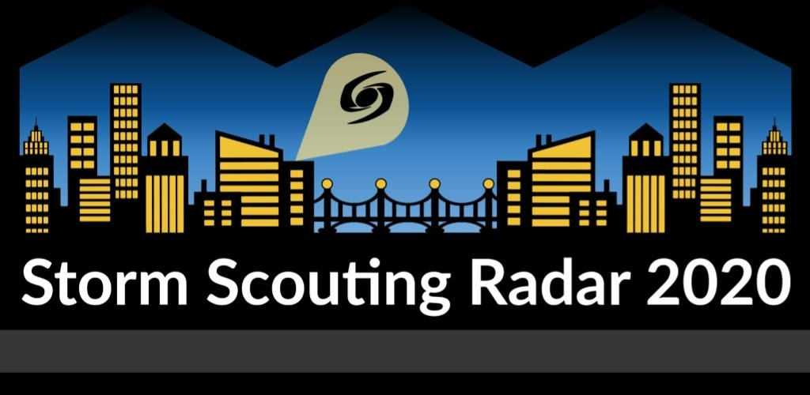

# StormAppMaster2020

This is the project for __Storm Scouting Radar 2020: Master__, a scouting app for FRC developed by Storm Robotics (FRC 2729).  
## Information
Storm Scouting Radar 2020: Master can be downloaded from the Google Play store [here](https://play.google.com/store/apps/details?id=org.stormroboticsnj).  

For a full guide on the features of this app and how to use it, along with our companion user app, please read [this document](https://drive.google.com/open?id=1DC6P04GL2XGpKgMuIIIKCxcjumR6969DBRzcdnnvy1M).  

Our privacy policy for this app is available in [this document](https://drive.google.com/open?id=1qYCvt0eGiPle1d9VVWu7vAZr5h4CDdzS16_cOC7WbFw).  

## Building this project
If you would like to build this project yourself instead of downloading it from the play store, follow these instructions:  

_Instructions_  

---

Scouting Radar by Storm Robotics Team. <a href="stormroboticsnj.org">stormroboticsnj.org</a>  
  

